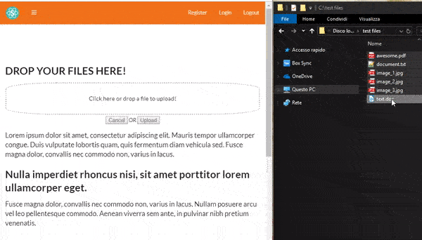

# styled-dropzone

A React component built on top of https://react-dropzone.js.org with the following features:

- CSS styling already included and easy to customize
- ready to POST to your API
- Multiple drop
- Upload confirm
- Review multidrop files and remove items before upload
- Auto Previews if dropped files are images
- auto block files within given sizes ( between numeric range fileMinSize and fileMaxSize )



### &lt;StyledDropzone />

| property    | type   | default                    | required | purpose                                                                                                                                                |
| ----------- | ------ | -------------------------- | -------- | ------------------------------------------------------------------------------------------------------------------------------------------------------ |
| **postUrl** | string | 'https://httpbin.org/post' | **Yes**  | API url to POST, use 'https://httpbin.org/post' as example                                                                                             |
| inputName   | string | 'file2upload'              | No       | Optional form data input name                                                                                                                          |
| fileMaxSize | number | 10485760                   | No       | value in Bytes of file max size default is 10485760 Bytes (10MB)                                                                                       |
| fileMinSize | number | 1                          | No       | value in Bytes of file min size default is 1 Byte, no 0 Bytes files                                                                                    |
| apiKey      | string | false                      | No       | if used it will add to your form data body the key 'apiKey' with your apiKey value. Code example: `if (apiKey) { formData.append('apiKey', apiKey); }` |

Sample code:

```JSX
  import React from 'react';
  import StyledDropzone from '../components/StyledDropzone';

  export default class extends React.Component {
    render() {
      return (
        <div>
          <StyledDropzone
            postUrl="https://httpbin.org/post"
            inputName="uploadFile"    // OPTIONAL
            fileMaxSize={10485760}    // OPTIONAL
            fileMinSize={1}           // OPTIONAL
            apiKey="superSecretKey123"// OPTIONAL
          />
        </div>
      );
    }
  }
```
